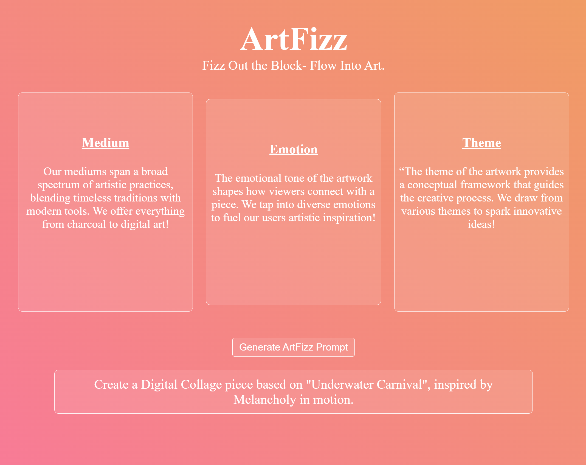

# 🥤 ArtFizz — Fizz Out the Block- Flow Into Art.
A cute typeScript-powered interface designed to end art-block once and for all!

---

## 🚀 Features
- Get prompts for art themes, mediums, and even the emotion of your piece!
- Hit the generate-prompt button to recieve a randomized art prompt!

---

## 🧠 Technologies Used
- Node ^24.1.0
- Typescript ^5.8.3
- HTML & CSS

---

## 🖼️ Demo


---

## 🛠️ Setup Instructions
```bash
# Clone the repo
git clone https://github.com/BiancaSauceda/typescript-project.git

# Move into the project
cd typescript-project

# Install dependencies
npm install

# Compile TypeScript
npx tsc

# Run the app
npm start